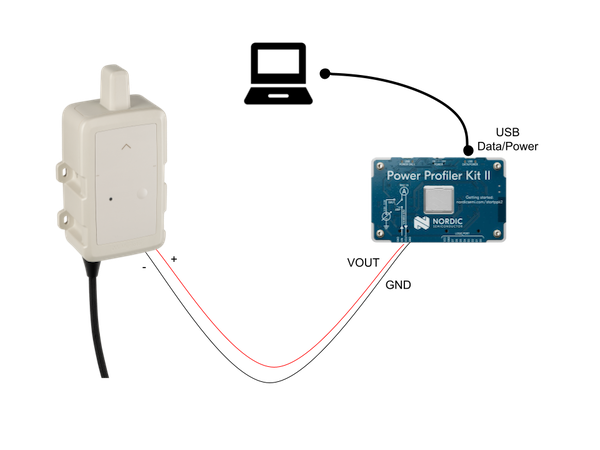

# Myriota Flex SDK

The **Myriota Flex SDK** provides all the tools and boilerplate necessary to develop ultra-low-power, satellite-connected IoT applications for the **Myriota FlexSense** device.

FlexSense is a rugged, off-the-shelf hardware platform that enables **bi-directional, direct-to-orbit (D2O)** satellite communications with advanced sensing and power management features.

* [FlexSense Device](https://myriota.com/flexsense/)
* [Developer Documentation](https://flex-docs.myriota.com/)
* [Reference Applications](https://github.com/Myriota/Flex-Reference-Applications)
* [Pre-built Binaries](https://devicemanager.myriota.com/binaries)
* [Myriota Support Site](https://support.myriota.com/)

> [!IMPORTANT]
> Reference applications and binaries are for **lab testing only**—not for production use.

---

## Requirements

### Building Applications
- Host: Ubuntu 22.04 (native), or [DevContainer](https://code.visualstudio.com/docs/devcontainers/containers) (Windows) from within [VSCode](https://code.visualstudio.com/), or [Github Codespaces](https://docs.github.com/en/codespaces/overview)
- Python ≥ 3.10
- GNU ARM Toolchain (provided)
- Meson ≥ 0.61.2,
- Ninja ≥ 1.10.1
- [VSCode](https://code.visualstudio.com/) (for container builds)
- Internet access for SDK binary downloads

> [!NOTE]
> You can ignore the gcc version as it is only installed as a
> requirement of meson native builds, but not used in the cross
> building process.

Detailed setup instructions are outlined in the following sections:
* [Ubuntu 22.04](#setting-up-ubuntu-2204)
* [DevContainer on Windows](#setting-up-devcontainer-on-windows)
* [Github Codespaces](#setting-up-github-codespaces)

### Hardware Requirements
- Myriota [FlexSense Device](https://myriota.com/flexsense/)
- USB-C data cable

### Other Requirements
- Myriota [Device Manager](https://devicemanager.myriota.com/) account credentials.
- An internet connection is required to download the latest Myriota SDK, system image, and network information files.

---

## Build Environment Setup

### Setting up Ubuntu 22.04

#### Install required packages
```shell
sudo apt install \
 git \
  curl \
 xxd \
  meson \
 ninja-build \
  gcc \
 python3 \
  python3-pip \
 python-is-python3
```

> [!TIP]
> If you install these programs via other methods, then make sure
> they meet these version requirements:
>  - **meson >= 0.61.2**
>  - **ninja >= 1.10.1**
>  - **python >= 3.10.12**
>
> You can ignore the gcc version as it is only installed as a
> requirement of meson native builds, but not used in the cross
> building process.

#### Install the ARM toolchain
> [!NOTE]
> The following commands assume your working directory to be the project root folder.

```shell
sudo ./scripts/install_arm_toolchain.sh
```
> [!IMPORTANT]
> You must update your `PATH` variable to include the toolchain. i.e.
> Add `export PATH="${PATH}:/opt/gcc-arm-13_2_1/bin"` to your `~/.profile` or
> wherever you configure your environment variables for your given
> shell.

#### Install Python Requirements

Install the correct Python environment with:

```shell
pip3 install -r requirements.txt
```

> [!NOTE]
> For simplicity, we install the Python packages globally, but you
> can also use a Python virtual environment. See
> [here](https://docs.python.org/3/tutorial/venv.html)
> for details.

### Setting Up DevContainer on Windows

To build applications using a DevContainer on Windows, you should first install
[VSCode](https://code.visualstudio.com/). When you open the Flex SDK folder in
VSCode it should direct you through the steps that are required to set up your
[DevContainer](https://code.visualstudio.com/docs/devcontainers/containers).
Once you have the DevContainer open in a terminal, you will be able to perform
the [build instruction](#building-the-user-application).

### Setting Up Github Codespaces

Codespaces is a cloud development environment provided by Github. Further
information on how to use Codespaces is available in the
[Github documentation](https://docs.github.com/en/codespaces/overview).

> [!TIP]
> Note that using Codespaces may incur a cost. Refer to the Github
> documentation for details regarding pricing, storage, and usage.

### Downloading libflex and system_image binaries

> [!IMPORTANT]
> Irrespective of the build environment, after the setup has been done the `libflex.a` and `system_image.bin` binaries must be downloaded and installed
in the correct location to perform a build.

Downloading and installing the `libflex.a` and `system_image.bin` binaries can be achieved by running the following command:

```shell
python scripts/download_binaries.py
```

> [!IMPORTANT]
> You require valid Myriota [Device Manager](https://devicemanager.myriota.com/) credentials to
> download the binaries. The script will prompt you to supply them.

## Building The User Application

### 1. Setup (run once)
The following build instructions assume your current working directory is the project root. Configure the build with the following command (this only needs to be run once):

```shell
meson --cross-file ./flex-crossfile.ini build
```

> [!IMPORTANT]
> Make sure to provide the `--cross-file ./flex-crossfile.ini` otherwise
> the build will fail.


#### Setup Options
##### 1. Skip GNSS
To assist development where a GPS signal is difficult to obtain, for example, in an indoor environment, the Flex SDK provides the `skip_gnss` option.<br />
By default, the `skip_gnss` option is disabled. To enable this option in the build, add `-Dskip_gnss=true` in the setup step, before building:

```shell
meson -Dskip_gnss=true --cross-file ./flex-crossfile.ini build
```

> [!IMPORTANT]
> During production builds, please validate that the `skip_gnss` option is
> disabled (set to false), to ensure the correct operation of the FlexSense device.

##### 2. Disable BLE Advertising

The FlexSense has BLE support that allows the user to use Myriota's FlexAssist
Mobile Application to program the device and fetch device diagnostic and configuration parameters. The Flex SDK provides the ability to
disable this functionality via the `disable_ble_adv` option.<br />
By default, the `disable_ble_adv` option is disabled. To enable this option in
the build, add `-Ddisable_ble_adv=true` in the setup step, before
building:

```shell
meson -Ddisable_ble_adv=true --cross-file ./flex-crossfile.ini build
```

> [!NOTE]
> This flag does not disable the requirement for the BLE module firmware to be
> up to date, nor does it disable the BLE module itself. This flag is
> used to prevent the BLE module from advertising over BLE.

### 2. Build
After the setup has been completed, a build is performed by running the commands:

```shell
meson compile -C build
```

> [!IMPORTANT]
> After building the source, the compiled user application will be available
> under the `build/` directory as `user_application.bin`. You can also find
> compiled versions of examples under `build/examples/`.

> [!NOTE]
> You can find the source code of the examples in the `examples` directory.

### 3. Pristine Build
To perform a pristine build, delete the `build` folder before running the
[Setup](#1.-Setup-(run-once)) and [Setup](#2.-Build) commands again.

```shell
rm -rf build
```

## Programming The FlexSense
Programming a FlexSense device requires the flashing of three separate images:

BLE Firmware or `ble_firmware.bin` (Once per SDK version)
System Image or `system_image.bin` (Once per SDK version)
User Application or `user_application.bin`

> [!IMPORTANT]
> The System Image only needs to be flashed once during development or on the
> release of a new Flex SDK. The User Application is what you
> will be developing, so update it as you need.
>
> **If you flash the System Image, you must re-flash the User Application.**

There are multiple options for programming your FlexSense device.
1. Using the updater.py script via the command line.
2. Using the DeviceAssist PC tool (Windows/MacOS/Linux) that is available from the **Tools** section of the [Myriota Support Site](https://support.myriota.com/)
3. Using the FlexAssist Mobile Application that is available on [Android](https://play.google.com/store/apps/details?id=com.myriota.binzel&hl=en) and [iOS](https://apps.apple.com/us/app/flexassist/id6474694371?uo=2)

> [!IMPORTANT]
> If you are flashing your firmware through the FlexAssist Mobile application by selecting the "local file" option on your device, the *.nonetwork.bin file must be used.
> Don't forget to update your Network info after programming your user application for faster deployment of your FlexSense.

> [!NOTE]
> The command line can not be used to update the BLE Firmware.

The instructions below outline how to program the System Image and User Application via the command line.

### Programming Via Command Line

#### Programming on Linux

The following programming instructions assume your current working directory
is the project root. To program the System Image, run:

```shell
./scripts/updater.py -f ./subprojects/libflex/system_image/system_image-*.bin
```

To program the User Application:

```shell
./scripts/updater.py -m ./build/user_application.bin
```

#### Programming on Windows

##### 1. Install Python and Python Requirements

Programming the FlexSense requires Python version 3.10 or greater.

The following instructions can be used to install Python on a Windows platform.

> [!IMPORTANT]
> The following commands should all be performed from within a Windows Terminal
> Shell (CMD or PowerShell).

Install Python:

```powershell
winget install -e --id Python.Python.3.10
```

Then navigate the Flex SDK project's root directory, and run the following:

```powershell
pip3 install -r requirements.txt
```
##### 2. Programming the FlexSense

The following programming instructions assume your current working directory
is the project root. To program the System Image, run:

```shell
python .\scripts\updater.py -f .\subprojects\libflex\system_image\system_image-*.bin
```

To program the User Application, run:

```shell
python .\scripts\updater.py -m .\build\user_application.bin
```

#### MacOS
##### 1. Create a Python Virtual Environment
The following programming instructions assume your current working directory
is the project root.

Create the virtual environment:
```shell
python -m venv .venv
```

Activate the virtual environment:
```shell
source .venv/bin/activate
```
Your shell should now be prefixed with `(.venv)`

#### 2. Install Python Requirements
```shell
pip3 install -r requirements.txt
```

#### 3. Programming the FlexSense
To program the System Image:

```shell
./scripts/updater.py -f ./subprojects/libflex/system_image/system_image-*.bin
```

To program the User Application:

```shell
./scripts/updater.py -m ./build/user_application.bin
```


### Programming via DeviceAssist
Myriota DeviceAssist is a desktop tool that supports the following functionality across the Myriota product range that is available from the **Tools** section of the [Myriota Support Site](https://support.myriota.com/)

- Read the Myriota module ID
- Read the Module registration code
- Print the debug information in boot-loader mode
- Update the device with the following binary images:
    - BLE firmware
    - System image
    - User application image
    - Network information

Instructions on how to program the Device using DeviceAssist can be found in the DeviceAssist User Guide located at the same location as mentioned above.

### Programming via FlexAssist
The FlexAssist Mobile Application, available on [Android](https://play.google.com/store/apps/details?id=com.myriota.binzel&hl=en) and [iOS](https://apps.apple.com/us/app/flexassist/id6474694371?uo=2), features a `Downloads` tab in the bottom menu.

The latest firmware can be downloaded from the `Downloads` tab, which saves the files on your device so that they can be programmed onto a device where there may not be network connectivity.

Once your FlexSense is powered on, you will be able to connect to it and program it with the downloaded firmware on the `System Update` tab.

## Power Management
One of the key benefits of FlexSense is its ultra-low power design, enabling years of battery life on a pair of AA Alkaline cells. However, verifying that your firmware is behaving as expected and allowing the FlexSense to enter its low-power modes requires measuring current draw directly.

This section guides you through using a [Nordic Power Profiler Kit II (PPK2)](https://www.nordicsemi.com/Products/Development-hardware/Power-Profiler-Kit-2) to observe the actual power profile of your FlexSense firmware and verify that the device enters low-power sleep between jobs.

> [!NOTE]
> This guide focuses on the PPK2, but many alternatives to the PPK2 exist and can be used for this application.
> The PPK2 is cost-effective, but it is not the most accurate option on the market.

> [!IMPORTANT]
> The FlexSense must not be connected to both USB and PPK simultaneously, as only one power source can be connected at a time.

### Required Equipment
- Myriota [FlexSense Device](https://myriota.com/flexsense/) (batteries removed)
- [Nordic PPK2 (Power Profiler Kit II)](https://www.nordicsemi.com/Products/Development-hardware/Power-Profiler-Kit-2)
- Micro-USB cable for PPK2
- [nRF Connect for Desktop](https://www.nordicsemi.com/Products/Development-tools/nRF-Connect-for-Desktop) + Power Profiler App (downloaded from within nRF Connect for Desktop)

### How to Measure Current Draw
The following is the wiring diagram to perform the current draw measurement using a PPK2.



> [!IMPORTANT]
> Double-check polarity. Reversed polarity may damage your FlexSense device.

1. Connect the FlexSense battery terminals to the PPK2.
2. Connect the PPK2 to the PC, Launch nRF Connect for Desktop and Open the Power Profiler app.
3. Select your PPK2 and set the Power Supply Mode to `Source Meter`
4. Set the source voltage to 3600mV (to emulate L91 lithium cells) and enable the power output.
5. Set the sampling to 100,000 samples per second, which is set to sample forever.
6. Click Start

#### Expected Current Profile
| State | Current (typical) | Description | Duration |
| :----- | :-----------------: | :----------- | :-------- |
| Soft Off | 1uA - 2 uA | This is the current expected when the FlexSense is powered, but the button has not been pressed for the first time| Until the button is pressed|
| Wake Up and GNSS Fix | 5mA - 2A | The device is executing its boot procedure and acquiring a GNSS fix | 90s to 120s |
| BLE Advertising | 0.5mA - 2mA | The BLE is advertising, and the device can be connected to in the FlexAssist Mobile App | 60s |
| Sleep | less than 10uA | The FlexSense is in Low Power mode | Until next Job |

#### Troubleshooting High Sleep Current
| Symptom | Likely Cause | Potential Fix |
| :----- | :---------- | :----------- |
| Sleep current greater than 10 µA | GPIO or peripheral leakage | Confirm that where `Init` API functions were used, `De-Init` functions were called before a job is finished. |
| Sleep current greater than 100uA | BLE advertising not switched off | Confirm that no devices are connected to the FlexSense via Bluetooth, as this will keep the BLE on. |
| Sleep current never below 1mA | The Device is not entering Sleep mode | Confirm that there are no loops or functions in your user application that will keep a job from ending and allowing the system to enter Sleep mode. |


## Debugging & Logging
To view debug information and information you have printed out in your user application, connect FlexSense to your PC via USB.

> [!NOTE]
> High-level Device Diagnostics, such as GNSS location, RSSI, and battery voltage, are available by connecting to FlexSense using the FlexAssist app.

### 1. Terminal
Open a terminal with the following configuration:
| Parameter | Value |
| :----- | :-----: |
| Baud Rate | 115200 |
| Parity | None |
| Flow Control | None |
| Data Bits | 8 |
| Stop bits | 1 |

### 2. DeviceAssist
1. Open DeviceAssist and connect to the FlexSense as described in the DeviceAssist User guide available from the **Tools** section of the [Myriota Support Site](https://support.myriota.com/).
2. Boot the Device and view the debug information in the `Device Output` tab.

## Troubleshooting
| Issue | Suggestion |
| :----- | :----- |
| GNSS doesn't get a Fix | Ensure the FlexSense is deployed with sufficient sky view (Refer to the [FlexSense User guide](https://support.myriota.com/hc/en-us/articles/9910489338639-User-Guides)) |
| I2C communication to an external sensor is not working | Ensure the cable length from the FlexSense to the I2C Sensor is no more than 1 meter (3 feet) |
| Unexpected device prints in the terminal or Device Output tab of Device Assist| Ensure that the BLE firmware and System image are the latest versions available from the [Device Manager](https://devicemanager.myriota.com/binaries) and that the user application is built with the latest [Flex-SDK](https://github.com/Myriota/Flex-SDK) version available|

If you require further assistance, please [submit a ticket](https://support.myriota.com/hc/en-us/requests/new).
